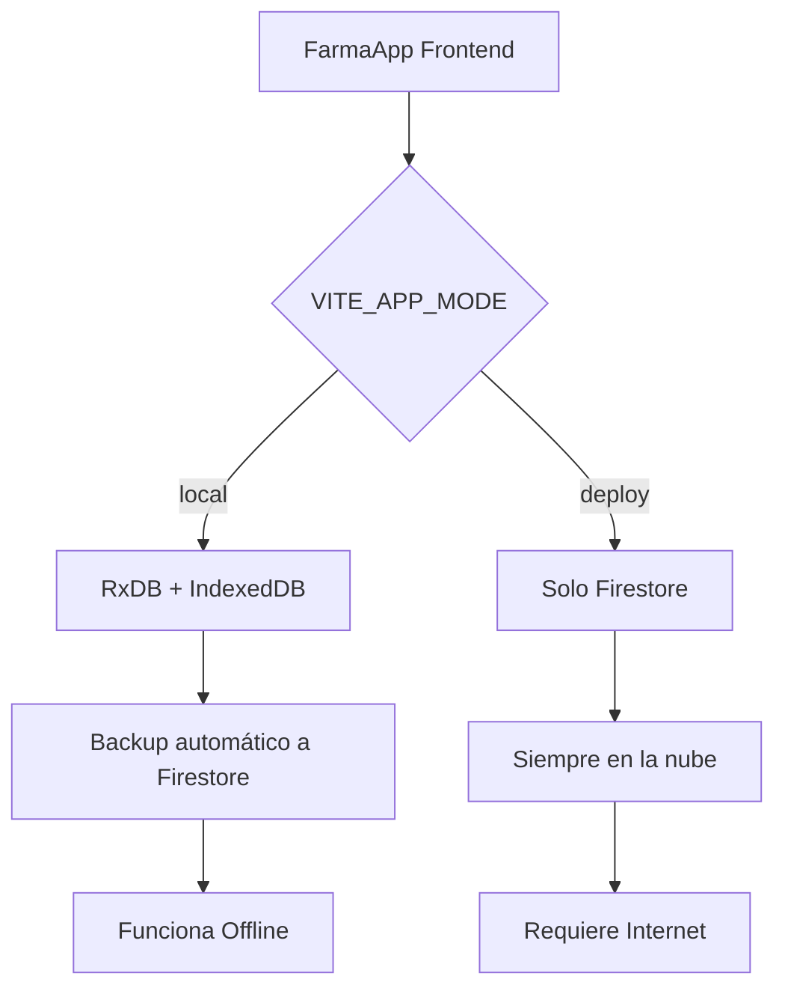

# 🏥 FarmaApp - Sistema de Gestión Farmacéutica MonoRepo

Sistema moderno de gestión farmacéutica con **arquitectura híbrida** que funciona tanto offline como online. Desarrollado con tecnologías web modernas y compatible con Electron para aplicaciones de escritorio.

## 📁 Estructura del Proyecto

```
MonoRepoApp/
├── package.json                 # Configuración principal del monorepo
├── frontend/                    # Frontend React con arquitectura híbrida
│   ├── src/
│   │   ├── services/           # Servicios de base de datos (RxDB/Firestore)
│   │   ├── stores/             # Estado global (Redux Toolkit)
│   │   ├── components/         # Componentes React
│   │   └── utils/              # Utilidades y configuración
│   ├── .env                    # Configuración base (modo local)
│   ├── .env.development        # Configuración desarrollo
│   ├── .env.production         # Configuración producción (deploy)
│   ├── .env.local              # Configuración personal (gitignored)
│   └── README.md               # Documentación completa del frontend
├── electron/                   # Aplicación Electron
│   ├── main.ts                 # Proceso principal Electron
│   └── preload.ts              # Script preload para seguridad
├── dist-electron/              # Compilado de Electron
├── release/                    # Builds finales para distribución
└── README.md                   # Documentación del monorepo (este archivo)
```

## 🏗️ Arquitectura Híbrida

FarmaApp utiliza una **arquitectura única** que se adapta según el entorno:

### **Modo Local** (`VITE_APP_MODE=local`) - *Default*
- **Base de datos**: RxDB + IndexedDB (navegador)
- **Backup en la nube**: Firestore (sincronización automática)
- **Ideal para**: Desarrollo, aplicaciones offline-first, Electron

### **Modo Deploy** (`VITE_APP_MODE=deploy`)
- **Base de datos**: Solo Firestore (nube)
- **Ideal para**: Aplicaciones web en producción



## 🛠️ Stack Tecnológico

### **Frontend (Completo)**
- **React 19** - Biblioteca de UI con hooks modernos
- **TypeScript** - Tipado estático
- **Vite** - Build tool rápido y HMR
- **React Router 7** - Enrutado SPA
- **Redux Toolkit** - Estado global
- **Tailwind CSS** - Framework CSS utilitario
- **RxDB** - Base de datos reactiva local
- **Firestore** - Base de datos en la nube
- **Firebase Auth** - Autenticación

### **Desktop (Electron)**
- **Electron** - Framework multiplataforma
- **TypeScript** - Tipado estático
- **IPC** - Comunicación entre procesos

## 🚀 Instalación y Configuración

### Requisitos Previos
- **Node.js** >= 18.0.0
- **npm** >= 8.0.0
- **Cuenta Firebase** (para modo deploy o backup)

### 1. Instalación Rápida
```bash
# Clonar el repositorio
git clone <url-del-repo>
cd MonoRepoApp

# Instalar todas las dependencias
npm run install:all
```

### 2. Configuración de Variables de Entorno

El proyecto utiliza **múltiples archivos .env** con jerarquía de prioridad:

```
frontend/.env.local      # ← MAYOR PRIORIDAD (gitignored, personal)
frontend/.env.development # ← Desarrollo automático
frontend/.env.production  # ← Producción
frontend/.env            # ← Base/fallback
```

#### Configuración Mínima (Modo Local)
Crear `frontend/.env.local`:
```env
# Modo de la aplicación
VITE_APP_MODE=local

# Solo requerido para backup a Firestore (opcional)
VITE_FIREBASE_API_KEY=tu_api_key
VITE_FIREBASE_AUTH_DOMAIN=tu_proyecto.firebaseapp.com
VITE_FIREBASE_PROJECT_ID=tu_proyecto_id
```

#### Configuración Completa (Modo Deploy)
Para producción, configurar todas las variables de Firebase en `.env.production`

> 📋 **Ver documentación completa** en [`frontend/README.md`](./frontend/README.md)

## 🎮 Scripts Disponibles

### Desarrollo Web
```bash
# Frontend desarrollo normal (puerto 5173)
npm run dev:frontend

# Forzar modo local (development)
cd frontend && npm run dev:local

# Desarrollo con configuración de producción
cd frontend && npm run dev:production
```

### Desarrollo Electron
```bash
# Compilar Electron en watch mode
npm run dev:electron:watch

# Ejecutar Electron (requiere compilación previa)
npm run dev:electron

# Desarrollo completo Electron + Frontend integrado
npm run dev

# Desarrollo con frontend independiente + Electron
npm run dev:full
```

### Construcción y Distribución
```bash
# Construir frontend para producción
npm run build:frontend

# Construir todo el proyecto
npm run build

# Crear ejecutable para Windows (.exe)
npm run package:win

# Crear ejecutables para todas las plataformas
npm run package:linux    # Linux (AppImage, .deb)
npm run package:mac      # macOS (.dmg)
npm run package          # Todas las plataformas

# Script automatizado completo
./build.sh

# Limpiar archivos compilados
npm run clean
```

### Utilidades
```bash
# Instalar dependencias en todos los proyectos
npm run install:all

# Verificar configuración de entorno
cd frontend && npm run debug:env
```

## ⚙️ Configuración de Entornos

### Jerarquía de Archivos `.env` (Vite)
```
frontend/.env.local       # ← MAYOR PRIORIDAD (personal, gitignored)
frontend/.env.development # ← Desarrollo automático  
frontend/.env.production  # ← Producción (npm run build)
frontend/.env             # ← Base/fallback
```

### Variables Principales
```env
# Modo de aplicación (local o deploy)
VITE_APP_MODE=local

# Configuración Firebase (solo si usas backup/deploy)
VITE_FIREBASE_API_KEY=
VITE_FIREBASE_AUTH_DOMAIN=
VITE_FIREBASE_PROJECT_ID=
VITE_FIREBASE_STORAGE_BUCKET=
VITE_FIREBASE_MESSAGING_SENDER_ID=
VITE_FIREBASE_APP_ID=

# URL del frontend (para Electron)
VITE_FRONTEND_URL=http://localhost:5173
```

### Puertos por Defecto
- **Frontend**: 5173 (desarrollo)
- **Electron**: Integra el frontend internamente

> 🔧 **Verificar configuración**: El frontend muestra automáticamente la configuración detectada en la consola del navegador.

## 🚀 Uso y Primeros Pasos

### 1. Desarrollo Web Rápido
```bash
# Instalar dependencias
npm run install:all

# Iniciar desarrollo
npm run dev:frontend
```
Ir a: **http://localhost:5174**

### 2. Desarrollo Electron Completo
```bash
# Terminal 1: Frontend
npm run dev:frontend

# Terminal 2: Electron
npm run dev:electron
```

### 3. Distribución (.exe para Windows)
```bash
# Generar ejecutable automáticamente
./build.sh

# O manualmente:
npm run package:win
```

**Archivos generados:**
- `FarmaApp-1.0.0-x64.exe` - Versión portable 64 bits (~95 MB)
- `FarmaApp-1.0.0.exe` - Instalador completo (~185 MB)
- `FarmaApp-1.0.0-ia32.exe` - Instalador 32 bits (~89 MB)

### 3. Credenciales Demo
Al abrir la aplicación por primera vez:

- **URL Login**: http://localhost:5173/login
- **Email**: admin@farmaapp.com  
- **Contraseña**: admin123

> ⚠️ **Importante**: Cambia estas credenciales en producción.

### 4. Funcionalidades Disponibles
- ✅ **Login/Logout** - Autenticación completa
- ✅ **Gestión de Usuarios** - CRUD completo
- ✅ **Dashboard** - Panel principal
- ✅ **Modo Offline** - Funciona sin internet (modo local)
- ✅ **Sincronización** - Backup automático a Firestore
- 🔄 **Productos** - (Próximamente)

### 5. Navegación
- **Dashboard**: `/` 
- **Login**: `/login`
- **Gestión Usuarios**: `/users`

## 🏗️ Arquitectura Detallada

### Frontend Híbrido
```
src/
├── features/           # Módulos de funcionalidad
│   ├── dashboard/     # Panel principal
│   ├── login/         # Autenticación
│   └── users/         # Gestión usuarios
├── shared/
│   ├── db/           # RxDB + Firestore
│   ├── services/     # Lógica de negocio
│   ├── store/        # Estado global (Redux)
│   └── config/       # Configuración
└── routes/           # Enrutado React Router
```

### Base de Datos Reactiva
- **RxDB** con **IndexedDB** (almacenamiento local)
- **Firestore** (backup en la nube)
- **Sincronización automática** (modo local)
- **Queries reactivas** (cambios en tiempo real)

## 📊 Estado Actual del Proyecto

### ✅ Funcionalidades Completadas
- [x] **Migración RxDB**: Backend eliminado, todo funciona en frontend
- [x] **Autenticación**: Login/logout con JWT y crypto-js
- [x] **Gestión de Usuarios**: CRUD completo con validaciones
- [x] **Base de Datos Híbrida**: RxDB + IndexedDB + Firestore
- [x] **Configuración Multi-entorno**: 4 archivos .env con jerarquía
- [x] **UI Moderna**: React 19 + Tailwind CSS + TypeScript
- [x] **Navegación**: React Router 7 SPA
- [x] **Estado Global**: Redux Toolkit
- [x] **Modo Offline**: Funciona sin conexión (modo local)
- [x] **Hot Reload**: Desarrollo con Vite HMR
- [x] **Electron**: Aplicación de escritorio funcional

### 🔄 En Desarrollo
- [ ] **Gestión de Productos**: Migrar funcionalidad de inventario
- [ ] **Reportes**: Dashboard con métricas y gráficos
- [ ] **Configuración**: Panel de configuración de farmacia

### 🎯 Próximos Pasos
1. **Migrar Products Feature** a RxDB
2. **Testing**: Tests unitarios y de integración
3. **CI/CD**: Pipeline de deployment
4. **Distribución**: Builds para Windows/Mac/Linux
5. **PWA**: Progressive Web App capabilities

## 🔧 Scripts de Mantenimiento

```bash
# Limpiar completamente el proyecto
npm run clean
rm -rf node_modules frontend/node_modules
npm run install:all

# Verificar el estado de la aplicación
cd frontend && npm run debug:env

# Reconstruir Electron
npm run build:electron

# Reset completo (eliminar bases de datos locales)
# Desde DevTools del navegador:
# Application → Storage → Clear site data
```

## 🛠️ Resolución de Problemas

### Electron no inicia
```bash
# Verificar que main.js existe
ls dist-electron/main.js

# Si no existe, compilar:
npm run build:electron
```

### Error de configuración de entorno
```bash
# Verificar variables
cd frontend && npm run debug:env

# Verificar jerarquía de archivos .env
ls -la frontend/.env*
```

### Base de datos no funciona
1. Abrir DevTools del navegador (F12)
2. Ir a **Application → Storage**
3. Verificar **IndexedDB → rxdb-database**
4. Si hay problemas, hacer **Clear site data**

## 📚 Recursos y Documentación

### Documentación Principal
- **[Frontend README](./frontend/README.md)** - Documentación completa del frontend
- **[Estado Actual](./ESTADO_ACTUAL.md)** - Estado detallado de la migración
- **[Migración RxDB](./MIGRATION_RXDB_FRONTEND.md)** - Proceso de migración

### Tecnologías Usadas
- **[React 19](https://react.dev/)** - Framework frontend
- **[RxDB](https://rxdb.info/)** - Base de datos reactiva
- **[Firestore](https://firebase.google.com/docs/firestore)** - Base de datos en la nube
- **[Electron](https://www.electronjs.org/)** - Aplicaciones de escritorio
- **[Vite](https://vitejs.dev/)** - Build tool moderno
- **[Tailwind CSS](https://tailwindcss.com/)** - Framework CSS

## 🎉 Conclusión

**FarmaApp MonoRepo** es un sistema farmacéutico moderno que combina lo mejor de las tecnologías web y de escritorio:

✨ **Offline-First**: Funciona sin conexión a internet  
✨ **Cross-Platform**: Web, Windows, Mac, Linux  
✨ **Modern Stack**: React 19, TypeScript, RxDB, Firestore  
✨ **Developer Friendly**: Hot reload, TypeScript, debugging tools  
✨ **Production Ready**: Multi-entorno, seguridad, escalabilidad  

---

**🚀 Para empezar:** `npm run install:all && npm run dev:frontend`  
**📖 Documentación completa:** [`frontend/README.md`](./frontend/README.md)
