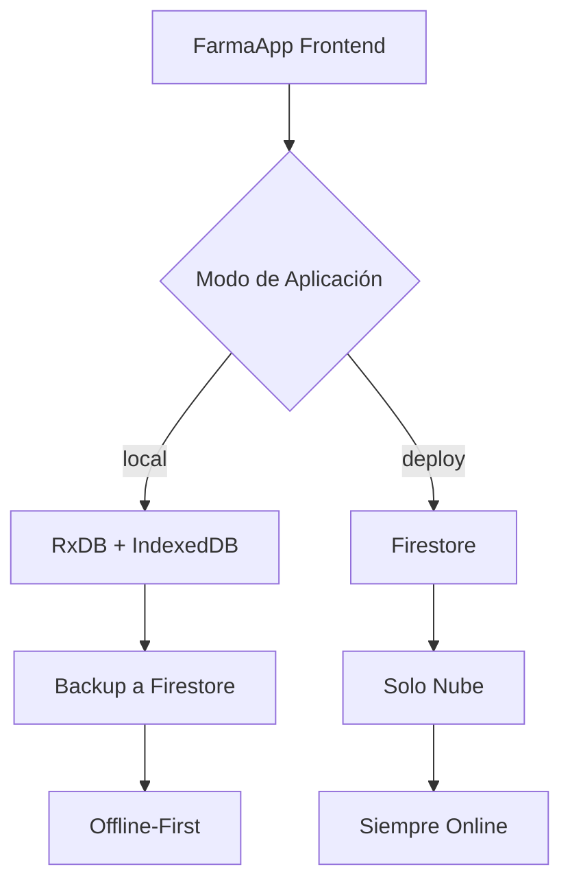
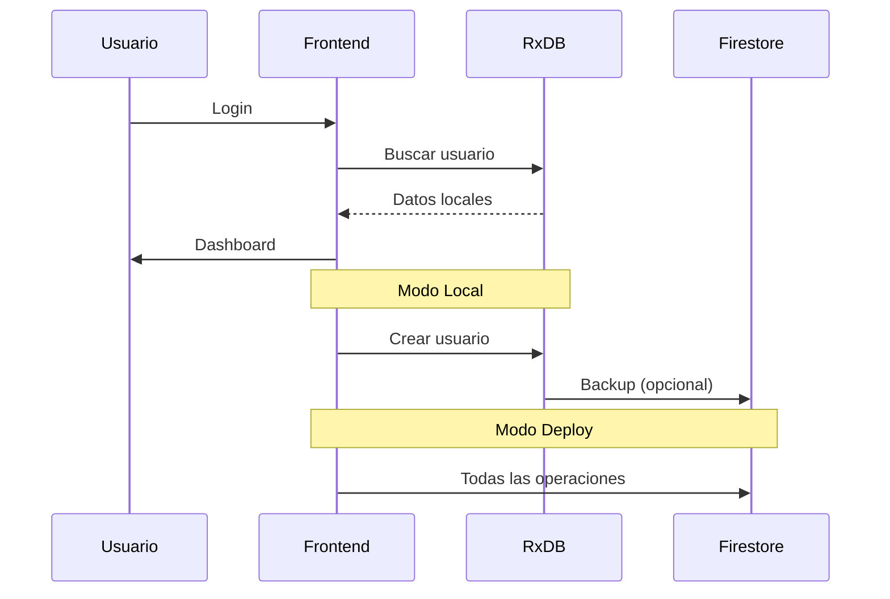

# 🏥 FarmaApp - Sistema de Gestión Farmacéutica

Sistema moderno de gestión farmacéutica con arquitectura híbrida que funciona tanto offline como online, desarrollado con tecnologías web modernas y compatible con Electron para aplicaciones de escritorio.

## 📋 Índice

- [🏗️ Arquitectura](#️-arquitectura)
- [🛠️ Tecnologías](#️-tecnologías)
- [💾 Bases de Datos](#-bases-de-datos)
- [⚙️ Configuración de Entornos](#️-configuración-de-entornos)
- [🚀 Instalación y Configuración](#-instalación-y-configuración)
- [📖 Uso](#-uso)
- [🔐 Autenticación](#-autenticación)
- [🧪 Testing](#-testing)
- [📚 Documentación](#-documentación)

## 🏗️ Arquitectura

FarmaApp utiliza una **arquitectura híbrida** que permite trabajar en dos modos:

### **Modo Local** (`VITE_APP_MODE=local`)
- **Frontend**: React + TypeScript + Vite
- **Base de datos local**: RxDB + IndexedDB (navegador)
- **Backup en la nube**: Firestore (sincronización opcional)
- **Ideal para**: Desarrollo, aplicaciones offline-first, Electron

### **Modo Deploy** (`VITE_APP_MODE=deploy`)  
- **Frontend**: React + TypeScript + Vite
- **Base de datos**: Solo Firestore (nube)
- **Ideal para**: Aplicaciones web en producción



## 🛠️ Tecnologías

### **Frontend**
- **React 19** - Biblioteca de UI con hooks modernos
- **TypeScript** - Tipado estático para JavaScript
- **Vite** - Build tool rápido y moderno
- **React Router 7** - Enrutado del lado del cliente
- **Redux Toolkit** - Gestión de estado global
- **Tailwind CSS** - Framework de CSS utilitario

### **Base de Datos**
- **RxDB** - Base de datos reactiva para el navegador
- **IndexedDB** - API de base de datos del navegador (vía Dexie)
- **Firestore** - Base de datos NoSQL de Firebase
- **Dexie** - Wrapper moderno para IndexedDB

### **Autenticación y Seguridad**
- **crypto-js** - Hashing de contraseñas (compatible con navegador)
- **jose** - JWT tokens (reemplazo de jsonwebtoken para navegador)
- **Firebase Auth** - Autenticación opcional en la nube

### **Desarrollo**
- **ESLint** - Linting de código
- **TypeScript** - Verificación de tipos
- **Electron** - Aplicaciones de escritorio
- **Vite HMR** - Hot Module Replacement

## 💾 Bases de Datos

### **RxDB + IndexedDB (Modo Local)**

```typescript
// Configuración RxDB
const database = await createRxDatabase({
  name: 'farmaapp_db',
  storage: getRxStorageDexie(),
  multiInstance: true,
  eventReduce: true
});
```

**Características:**
- ✅ **Offline-first**: Funciona sin conexión
- ✅ **Reactivo**: Observables y actualizaciones en tiempo real
- ✅ **Tipado**: Esquemas TypeScript completos
- ✅ **Sincronización**: Backup opcional a Firestore
- ✅ **Performance**: Acceso directo a datos locales

### **Firestore (Modo Deploy)**

```typescript
// Configuración Firestore
const firestore = getFirestore(firebaseApp);
const usersCollection = collection(firestore, 'users');
```

**Características:**
- ✅ **Escalable**: Maneja millones de documentos
- ✅ **Tiempo real**: Actualizaciones en vivo
- ✅ **Serverless**: Sin gestión de servidor
- ✅ **Seguridad**: Reglas de seguridad integradas

### **Esquemas de Datos**

#### **Usuario**
```typescript
interface UserDocument {
  id: string;
  fullName: string;
  email: string;
  passwordHash: string;
  role: 'admin' | 'cashier';
  active: boolean;
  createdAt: string;
  lastSession?: string;
}
```

#### **Producto** (Próximamente)
```typescript
interface ProductDocument {
  id: string;
  name: string;
  description: string;
  price: number;
  stock: number;
  category: string;
  barcode?: string;
  expirationDate?: string;
}
```

## ⚙️ Configuración de Entornos

FarmaApp utiliza múltiples archivos `.env` para diferentes entornos:

### **📁 Estructura de Archivos .env**

```
frontend/
├── .env                    # 📝 Base compartida
├── .env.development        # 🛠️ Desarrollo
├── .env.production         # 🚀 Producción
├── .env.local             # 🏠 Personal (no versionado)
└── .env.example           # 📋 Plantilla
```

### **🔄 Prioridad de Carga (Vite)**

```
.env.local          ← Mayor prioridad
.env.[mode]         ← .env.development o .env.production
.env                ← Base compartida
```

### **📋 Variables de Entorno**

#### **`.env` - Configuración Base**
```bash
# Modo de la aplicación
VITE_APP_MODE=local

# Firebase (para ambos modos)
VITE_FIREBASE_API_KEY=demo_api_key
VITE_FIREBASE_PROJECT_ID=demo-project
VITE_FIREBASE_AUTH_DOMAIN=demo-project.firebaseapp.com
VITE_FIREBASE_STORAGE_BUCKET=demo-project.appspot.com
VITE_FIREBASE_MESSAGING_SENDER_ID=123456789
VITE_FIREBASE_APP_ID=1:123456789:web:abcdef123456

# JWT Secret
VITE_JWT_SECRET=development_secret_key
```

#### **`.env.development` - Desarrollo**
```bash
# Modo local con debug
VITE_APP_MODE=local
VITE_DEBUG=true
VITE_LOG_LEVEL=debug
VITE_JWT_SECRET=development_secret_key_local_mode

# Flags de desarrollo
VITE_ENABLE_DEV_TOOLS=true
```

#### **`.env.production` - Producción**
```bash
# Modo deploy sin debug
VITE_APP_MODE=deploy
VITE_DEBUG=false
VITE_LOG_LEVEL=error

# Configuración de producción
VITE_FIREBASE_API_KEY=YOUR_PRODUCTION_API_KEY
VITE_FIREBASE_PROJECT_ID=your-production-project
VITE_JWT_SECRET=YOUR_STRONG_PRODUCTION_SECRET

# Seguridad
VITE_ENABLE_SECURITY_VALIDATIONS=true
```

#### **`.env.local` - Personal**
```bash
# Configuración local personal (no se versiona)
VITE_APP_MODE=local
VITE_DEBUG=true
VITE_LOG_LEVEL=debug
VITE_FIREBASE_PROJECT_ID=my-personal-project
```

### **🎯 ¿Qué archivo se usa?**

| Comando | Archivo Principal | Modo | Descripción |
|---------|------------------|------|-------------|
| `npm run dev` | `.env.development` | development | Desarrollo con RxDB |
| `npm run dev:local` | `.env.development` | development | Fuerza modo local |
| `npm run dev:production` | `.env.production` | production | Desarrollo con config de producción |
| `npm run build` | `.env.production` | production | Build para deploy |

## 🚀 Instalación y Configuración

### **1. Clonar el Repositorio**
```bash
git clone <repository-url>
cd MonoRepoApp/frontend
```

### **2. Instalar Dependencias**
```bash
npm install
```

### **3. Configurar Variables de Entorno**

#### **Opción A: Desarrollo Rápido (Recomendado)**
```bash
# Usar configuración por defecto
cp .env.example .env
npm run dev
```

#### **Opción B: Configuración Firebase Real**
```bash
# 1. Crear proyecto en Firebase Console
# 2. Obtener credenciales del proyecto
# 3. Configurar .env.local
cat > .env.local << EOF
VITE_APP_MODE=local
VITE_FIREBASE_API_KEY=tu_api_key_real
VITE_FIREBASE_PROJECT_ID=tu_proyecto_id
VITE_FIREBASE_AUTH_DOMAIN=tu_proyecto.firebaseapp.com
VITE_FIREBASE_STORAGE_BUCKET=tu_proyecto.appspot.com
VITE_FIREBASE_MESSAGING_SENDER_ID=tu_sender_id
VITE_FIREBASE_APP_ID=tu_app_id
VITE_JWT_SECRET=tu_clave_secreta_fuerte
EOF
```

### **4. Comandos Disponibles**

```bash
# Desarrollo
npm run dev              # Desarrollo normal (modo local)
npm run dev:local        # Fuerza modo development
npm run dev:production   # Desarrollo con config de producción

# Producción
npm run build            # Build para producción (modo deploy)
npm run build:local      # Build con config de desarrollo
npm run preview          # Preview del build

# Utilidades
npm run lint             # Verificar código
```

### **5. Verificar Instalación**

Abrir [http://localhost:5173](http://localhost:5173) y verificar en la consola:

```
🔧 CONFIGURACIÓN DE ENTORNO
Modo Vite: development
Modo App (VITE_APP_MODE): local
Archivo .env detectado: .env.development
Modo de base de datos: RxDB + IndexedDB + Firestore backup
```

## 📖 Uso

### **🔐 Credenciales por Defecto**

La aplicación crea automáticamente un usuario administrador:

```
📧 Email: admin@farmaapp.com
🔑 Contraseña: admin123
👨‍💼 Rol: admin
```

### **🎯 Funcionalidades Principales**

1. **Login/Logout** - Autenticación JWT
2. **Dashboard** - Vista principal con estadísticas
3. **Gestión de Usuarios** - CRUD completo de usuarios
4. **Roles** - Admin y Cajero con permisos diferentes

### **🧭 Navegación**

```
/login          # Página de inicio de sesión
/dashboard      # Dashboard principal
/users          # Gestión de usuarios (solo admin)
```

### **📱 Responsive Design**

La aplicación está optimizada para:
- 💻 **Desktop** - Experiencia completa
- 📱 **Mobile** - Adaptado para pantallas pequeñas
- 📟 **Tablet** - Diseño intermedio

## 🔐 Autenticación

### **🔒 Sistema de Seguridad**

```typescript
// Hash de contraseñas (crypto-js)
const passwordHash = CryptoJS.SHA256(password).toString();

// JWT Tokens (jose)
const token = await new SignJWT(payload)
  .setProtectedHeader({ alg: 'HS256' })
  .setExpirationTime('24h')
  .sign(secret);
```

### **👥 Roles y Permisos**

| Rol | Permisos |
|-----|----------|
| **admin** | ✅ Gestión de usuarios<br>✅ Ver dashboard<br>✅ Todas las funciones |
| **cashier** | ✅ Ver dashboard<br>✅ Gestión de ventas<br>❌ Gestión de usuarios |

### **🛡️ Validaciones de Seguridad**

- **Email**: Formato válido requerido
- **Contraseñas**: Mínimo 6 caracteres
- **Tokens**: Expiración de 24 horas
- **Encriptación**: SHA256 para contraseñas

## 🧪 Testing

### **🔍 Debug y Desarrollo**

```bash
# Funciones de debug disponibles en consola del navegador
clearAllData()           # Limpiar toda la base de datos
showEnvironmentInfo()    # Mostrar configuración actual
```

### **📊 Verificar Estado**

```bash
# Script de verificación
./check-env.sh          # Verificar configuración de entornos
```

### **🗃️ Reset de Base de Datos**

```javascript
// En consola del navegador (solo desarrollo)
await clearAllData();    // Limpia IndexedDB, localStorage, sessionStorage
location.reload();       // Recarga para reinicializar
```

## 📚 Documentación

### **📁 Archivos de Documentación**

```
📚 Documentación/
├── README.md                           # Este archivo
├── ESTADO_ACTUAL.md                    # Estado del proyecto
├── MIGRATION_RXDB_FRONTEND.md          # Detalles de migración
├── ENV_CONFIG.md                       # Configuración de entornos
└── frontend/API_DOCUMENTATION.md      # API y servicios
```

### **🔗 Enlaces Útiles**

- **[RxDB Documentation](https://rxdb.info/)** - Base de datos reactiva
- **[Vite Guide](https://vitejs.dev/guide/)** - Build tool
- **[Firebase Docs](https://firebase.google.com/docs)** - Backend como servicio
- **[React Router](https://reactrouter.com/)** - Enrutado
- **[Tailwind CSS](https://tailwindcss.com/)** - Framework CSS

### **🛠️ Arquitectura de Servicios**

```typescript
// UserService - Servicio unificado
const getUserDB = () => {
  return config.APP_MODE === 'local' ? localUserDB : firestoreUserDB;
};

// Switch automático entre bases de datos
await UserService.login(credentials);      // Funciona en ambos modos
await UserService.getAllUsers();           // Funciona en ambos modos
await UserService.syncToFirestore();       // Solo modo local
```

### **🔄 Flujo de Datos**




**📝 Última actualización**: 19 de junio de 2025  
**👨‍💻 Desarrollado con**: React + TypeScript + RxDB + Firestore  
**📄 Licencia**: MIT